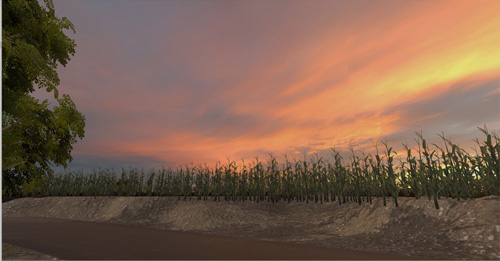

<iframe src="https://player.vimeo.com/video/258152957" width="640" height="389" frameborder="0" webkitallowfullscreen mozallowfullscreen allowfullscreen></iframe>

Here's a full video of me navigating the VR spaces that I created. I continued to add to the space I made from the previous "Recreating a Space" project. There aren't that many VR experiences (or popular media in general) that capture experiences of Midwestern life so I wanted to portray spaces that are reminiscent of places in my home state of Michigan.

I wasn't intending on creating a narrative with this piece, but I intentionally built them to be a part of the same world. In making sense of the scene sequencing, I had the spaces meld into each other with the user seeming to transition through the trees and then into the corn field.

There's also an element of timing where the scenes go from night to dark, suggesting that you're spending a certain amount of time in each place.

In the last scene, there's something jarring about being in natural spaces (through the unnatural portal of virtual reality) and then being pulled back to present through the iPhone ringtone. It's little bit of the the reality within a reality, but mostly I was interested in how something can be familiar and unfamiliar at the same time.

<!--more-->

In my research, I did find a few pieces that I thought were really great portraying Midwestern spaces. [This VR/360 video experience of a family farm in Iowa ](https://www.desmoinesregister.com/story/money/agriculture/2014/09/17/harvest-of-change-virtual-farm-virtual-reality/15785377/) is a journalism project, which seems to be a way to give a voice to modern family farmers. I actually watched the movie [Colombus](https://en.wikipedia.org/wiki/Columbus_(2017_film)) after making this, but the way it portrays places/spaces in Indiana is really beautiful. It's like the place is integral to the characters' narratives playing out.

Finally, here are some of the important resources I used while pulling things together:
* [Free3D.com - great for finding models when the Unity Asset Store doesn't have what you want!](https://free3d.com)
* [Recording of a Midwestern cornfield at night]( https://freesound.org/people/kvgarlic/sounds/244508/)
* [Unity Scripts from Sarah](https://docs.google.com/document/d/1XR7Xl0d_jen3r0zTQe3AkXURpuW6-fJmSO-sejT3OUM/)
