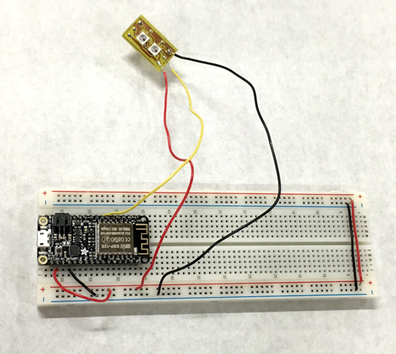

For my final project, I am planning on making a small grid of LEDs that can be controlled by users that can be controlled from a website from anywhere. Users will not be able to see the LED grid themselves unless they are physically able to see it, but are able to make changes. Hopefully, people will collectively create images or simply play around. This is kind of like a physical version of [Reddit Place](https://en.wikipedia.org/wiki/Place_(Reddit).

<!--more-->

### Part 1: Prototype with Feather Huzzah (Mostly Coding)

Starting out, I knew that I needed a microcontroller that could connect to wifi and have one digital pin for me to control an array of neopixels. The ESP8266 is capable of this, so I decided to start with a Feather Huzzah board to first get my code working.

A lot of my code is based on [this example](https://github.com/tttapa/ESP8266/tree/master/Examples/14.%20WebSocket/A-WebSocket_LED_control) from an ESP8266 guide. The main things I changed were the website that interfaces with the ESP8266 and the data protocol to send info from the browser (client) to the ESP8266 (server). I also added code to control the LEDs using the [Neopixel library](https://learn.adafruit.com/adafruit-neopixel-uberguide/arduino-library-use).

The main thing here is that the client is sending two values back to the server - the position of the LED (values range from 0-15) and the color code (range from 0 to 5). I decided to send this info in 8 bits, so each value takes up 4 bits. I used bit shifting to combine the two values (see line 8), and then I convert that to a string in hexidecimal (line 10).Finally, I send the data as a string to the server (line 13).

On the server side, I am basically reversing what I did to convert the string back to integer values.

### Part 2: Breadboard Prototype (Circuit Design/Uploading the Code)

I based my breadboard off of Adafruit's [ESP8266 Breakout](https://www.adafruit.com/product/2471) Eagle schematic. I wanted to upload code directly, so I am using an [FTDI Friend](https://www.adafruit.com/product/284) to convert USB to serial. We have the FTDI Friends in the ITP shop, so I didn't need to buy anything extra.

I set the Vcc to 3.3V by cutting the 5V jumper on the back and soldering the 3.3V pads on the back of the FTDI Friend. This is because the ESP8266's max. voltage is 3.6V!!! I originally had a LD33V regulator in my breadboard circuit, but it was dropping the voltage too low for the ESP8266 to upload code for some reason. I know I will need to have a 3V regulator on my final circuit, so I'll have to look for the right one.

Also, fun fact - TXD on your board goes to RXD on the FTDI cable. RXD on your board goes to TXD on the FTDI cable. That clearly makes sense, but at 2AM I did not do that.

Cool! One more thing - find the file called programmers.txt in the Arduino IDE files. Mine was located at the following folder: "/Library/Arduino15/packages/esp8266/hardware/esp8266/2.4.1/". And add the following code to the end of the file.

Before you upload your code, you need to set the ESP8266 to bootload mode. Here's what you do:

1. Hold the GPIO-0 button. Your LED will light up.
2. While holding the GPIO-0 button, press the reset button.
3. Let go of reset button.
4. Let go of GPIO-0 button.

Now I am able to upload code through the Arduino IDE! You need to do the button pressing thing each time before you upload code. Unless you do OTA uploads (; The next steps will be to convert my breadboard to an Eagle design and then fabricate!

### Helpful Resources That I Used

Hopefully this saves you some Googling.

**Javascript/JQuery**
* [Making drop down lists in JQuery](https://stackoverflow.com/questions/6601952/programmatically-create-select-list)
* [Get drop down values](https://stackoverflow.com/questions/4029281/get-drop-down-value)
* [Add ID to an element](https://stackoverflow.com/questions/2176986/jquery-add-id-instead-of-class)

**ESP8266 Code**
* [Reset the board before OTA will work (aka have tried turning it off and then on?)](https://www.esp8266.com/viewtopic.php?f=160&t=16808)
* [ESP8266FS - a tool you need to upload data files (not the sketch/firmware)](http://esp8266.github.io/Arduino/versions/2.0.0/doc/filesystem.html)
* [AMAZING GUIDE that I based my a lot of my code on (:](https://tttapa.github.io/ESP8266/Chap01%20-%20ESP8266.html)

**Figuring out the data protocol**
* [What does & do in C++?](https://stackoverflow.com/questions/11516181/what-does-bitwise-0x3ff-do)
* [Great explanation of bit shifting >> << ](https://www.interviewcake.com/concept/java/bit-shift)
* [Bitwise functions](https://www.w3schools.com/js/js_bitwise.asp)

**Breadboard Circuit/Uploading Code**
* [Upload code to ESP8266 without another Arduino](https://alselectro.wordpress.com/2016/11/07/esp8266-upload-code-from-arduino-ide-no-arduino-board-required/)
* [FTDI Friend Reference from Adafruit](https://learn.adafruit.com/ftdi-friend?view=all#programming-the-arduino-bootloader)
* [ESP8266 Breakout Reference from Adafruit](https://learn.adafruit.com/adafruit-huzzah-esp8266-breakout/using-arduino-ide)
* [ESP8266 Breakout Eagle Files](https://github.com/adafruit/Adafruit-Huzzah-ESP8266-Basic-Breakout-PCB)
